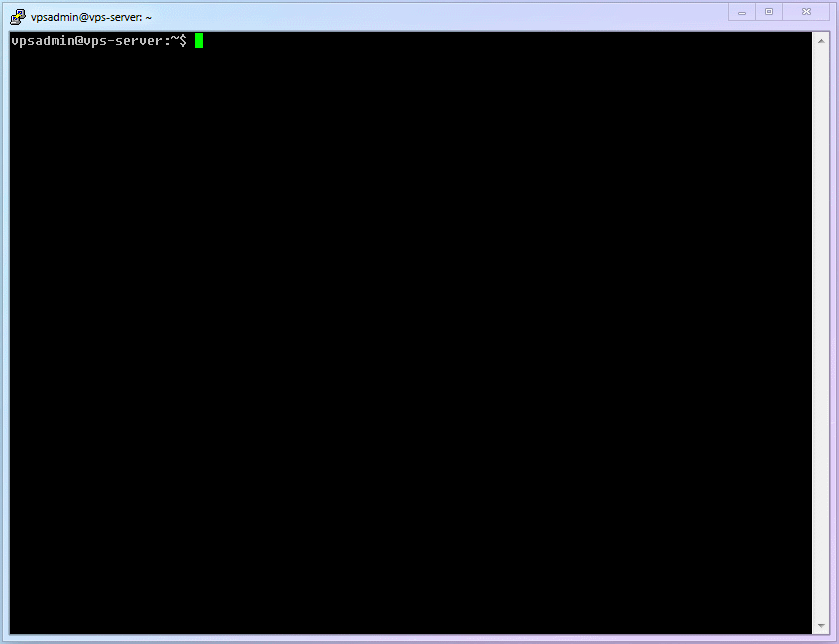

# 如何部署Xray

选择VPS就不介绍了。


## 1.申请域名和证书
这里只讲免费的域名如何申请，收费的域名就不说了。  
    1.freenom.com  
在这个网站上可以申请.tk  .cf 等后缀的免费域名，申请方法参考这个链接：[申请方法](https://zhujitips.com/328)  
   2.还有一些提供免费进行域名解析网站  
  它们的作用是不需要申请，直接将你的VPS的IP放在他们的域名前面，会自动解析到你的这个IP地址。比如：  1.2.3.4.sslip.io 将被自动解析到1.2.3.4这个IP地址，非常好用。  
 - https://sslip.io/
 - https://nip.io/
  
***证书申请***：
证书用来进行网站验证和通信加密。 我们需要为域名申请一个真实的 TLS 证书，使网站具备标准 TLS 加密的能力及 HTTPS 访问的能力， Xray 等proxy工具进行加密的工具。
证书申请大家都用acme.sh。命令如下，使用时需要将具体的域名替换成你需要的域名。
```
#运行安装脚本
```
wget -O -  https://get.acme.sh | sh
```
把 acme.sh 安装到你的 home 目录下:~/.acme.sh/并创建 一个 bash 的 alias, 方便你的使用:
```
alias acme.sh=~/.acme.sh/acme.sh
echo 'alias acme.sh=~/.acme.sh/acme.sh' >>/etc/profile
```
在第一步的安装过程中会自动为你创建 cronjob, 每天 0:00 点自动检测所有的证书, 如果快过期了, 需要更新, 则会自动更新证书。
```
00 00 * * * root /root/.acme.sh/acme.sh --cron --home /root/.acme.sh &>/var/log/acme.sh.logs
```

#让 acme.sh 命令生效
. .bashrc
#开启 acme.sh 的自动升级
acme.sh --upgrade --auto-upgrade
# 申请证书
# zerossl跟letsencrypt 一样的
./acme.sh  --issue --server zerossl -d example.com  -d www.example.com --standalone  -m yourname@gmail.com
```
webroot模式要求在服务器上已经运行了http服务(比如nginx)，并且可以通过公网访问，该模式的好处是，你无需在申请证书的过程中停止web服务，因此。
使用webroot模式申请证书时，acme.sh会在网站对应域名的webroot目录下生成域名验证文件, 然后通过公网访问之，以验证对域名的所有权。验证完毕后，acme.sh会清除这些临时生成的文件。
申请证书使用--issue命令：
```
acme.sh --issue -d example.com -d www.example.com -w  /home/webroot  -m yourname@gmail.com
```


在正式申请证书之前，可以先用测试命令(--issue --test)来验证是否可以成功申请，这样可以避免在本地配置有误时，反复申请证书失败，超过 Let's Encrypt 的频率上限（比如，每小时、每个域名、每个用户失败最多 5 次），导致后面的步骤无法进行。
下载的证书位于~/.acme.sh/example.com/目录下。  
该目录之下是证书、私钥等文件以及一些其它配置文件：
- 证书文件: example.com.cer
- 私钥: example.com.key
- 中间证书: ca.cer
- 证书链:fullchain.cer
  
***注意, 请不要直接使用此目录下的文件,因为这里面的文件都是内部使用, 而且目录结构可能会变化。***

正确的使用方法是使用 --installcert 命令,并指定目标位置, 然后证书文件会被copy到相应的位置, 命令如下:
```
./acme.sh  --installcert  -d  example.com   \
        --key-file   ~/ssl/example.com.key \
        --fullchain-file ~/ssl/fullchain.cer 
```

完整的过程示例：


## 2.部署Xray 
ss不要再使用了，包括SSR也不要再用。
kcptun也不能使用了。

这里介绍xray的部署，xray是在v2ray的基础上发展起来的代理工具，支持当前多种代理协议，且有庞大和活跃的支持团队。  

v2ray基础上有2个团队的产品更新比较及时，分别是以下2种，由于XTLS团队更活跃，我们以这个为示例。  
- Project X团队搞的xray： https://github.com/XTLS/Xray-core  
- v2fly团队搞的v2ray： https://github.com/v2fly/v2ray-core  

XTLS团队提供了一个示例配置库，引导小白进行配置，https://github.com/XTLS/Xray-examples
注意并不是每一个配置都可以用，有些比如VLESS-TCP就不安全，推荐采用下面2个
- VLESS-TCP-TLS-WS (recommended)
- VLESS-TCP-TLS
这里只介绍VLESS-TCP-TLS，VLESS相比VMESS更简单易用，单用VLESS不安全，必须套TLS。
server.json
下面的配置文件里面只需要修改带有“//”注释的行。
- uuid可以点击此链接生成：https://uuid.900cha.com/
- serverName 改成具体的域名
- certificateFile和keyFile 对应前面申请的证书，使用绝对路径
```
{
    "log": {
        "loglevel": "warning"
    },
    "inbounds": [
        {
            "listen": "0.0.0.0",
            "port": 443,
            "protocol": "vless",
            "settings": {
                "clients": [
                    {
                        "id": "",//generate a id 
                        "level": 0,
                        "email": "abc@example.com"
                    }
                ],
                "decryption": "none",
                "fallbacks": [
                    {
                        "dest": 8001
                    },
                    {
                        "alpn": "h2",
                        "dest": 8002
                    }
                ]
            },
            "streamSettings": {
                "network": "tcp",
                "security": "tls",
                "tlsSettings": {
                    "serverName": "example.com",//domain
                    "alpn": [
                        "h2",
                        "http/1.1"
                    ],
                    "certificates": [
                        {
                            "certificateFile": "/path/to/fullchain.crt", //certfile
                            "keyFile": "/path/to/private.key"    //private key
                        }
                    ]
                }
            }
        }
    ],
    "outbounds": [
        {
            "protocol": "freedom",
            "tag": "direct"
        }
    ]
}
```
客户端也在原有的内容上进行一些修改：
- adress 可以用IP，也可以用域名
- id 前面生成的uuid
- serverName 用域名
client.json
```
{
    "log": {
        "loglevel": "warning"
    },
    "inbounds": [
        {
            "listen": "127.0.0.1",
            "port": "1080",// 这个端口是客户端代理监听的端口， 需要用到
            "protocol": "socks",
            "settings": {
                "auth": "noauth",
                "udp": true,
                "ip": "127.0.0.1"
            }
        },
        {
            "listen": "127.0.0.1",
            "port": "1081",
            "protocol": "http"
        }
    ],
    "outbounds": [
        {
            "protocol": "vless",
            "settings": {
                "vnext": [
                    {
                        "address": "1.2.3.4",// ip or domain
                        "port": 443,
                        "users": [
                            {
                                "id": "",//uuid 
                                "encryption": "none",
                                "level": 0
                            }
                        ]
                    }
                ]
            },
            "streamSettings": {
                "network": "tcp",
                "security": "tls",
                "tlsSettings": {
                    "serverName": "example.domain",//domain
                    "allowInsecure": false,
                    "alpn": [
                        "h2",
                        "http/1.1"
                    ],
                    "disableSessionResumption": true
                }
            },
            "tag": "proxy"
        },
        {
            "protocol": "freedom",
            "tag": "direct"
        }
    ],
    "routing": {
        "domainStrategy": "AsIs",
        "rules": [
            {
                "type": "field",
                "ip": [
                    "geoip:private"
                ],
                "outboundTag": "direct"
            }
        ]
    }
}

```
